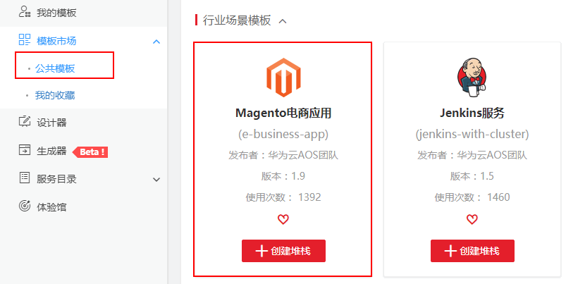

# 快速入门<a name="aos_02_0008"></a>

## 概述<a name="section142673304107"></a>

本文通过调用一系列应用编排服务的API编排部署Magento电子商务系统，介绍使用应用编排服务API的基本流程。

创建出的Magento电子商务系统如下所示：

**图 1**  Magento电子商务系统<a name="fig95042014192113"></a>  


API的调用方法请参见[如何调用API](如何调用API.md)。

## 创建流程<a name="section114621034191316"></a>

1.  调用[创建模板](创建模板.md)接口，上传**Magento电商应用**公共模板作为自己的模板。
2.  调用[查询模板输入](查询模板输入.md)接口，查看模板输入，作为后续创建堆栈时需要配置的输入参数的修改。
3.  调用[创建堆栈](创建堆栈.md)接口，创建Magento电子商务系统堆栈。
4.  调用[查询堆栈](查询堆栈.md)接口，查看堆栈创建是否成功。
5.  调用[查询堆栈输出](查询堆栈输出.md)接口，查询堆栈的输出，查看Magento电子商务系统。

## 编排部署Magento电子商务系统<a name="section22601849114717"></a>

1.  调用[创建模板](创建模板.md)接口，上传**Magento电商应用**公共模板作为自己的模板。
    1.  选择左侧导航栏的“模板市场“，单击“公共模板“。在“行业场景模板”下，单击**Magento电商应用**名称，查看详情。单击“下载模板”，保存公共模板文件（例如：e-business-app.yaml）到本地。

        **图 2**  选择公共模板<a name="fig1372884617273"></a>  
        

    2.  在本地编写**Magento电商应用**模板，保存到文件e-business-app.yaml中。上传模板文件e-business-app.yaml到执行curl命令的服务器的任一路径，例如/home/paas。
    3.  进入服务器中模板文件所在路径，调用[创建模板](创建模板.md)接口，上传**Magento电商应用**公共模板作为自己的模板。

        ```
        curl -k -X POST -H "X-Auth-Token: ${Token}" -F "resource={\"name\": \"aos-magento\",\"description\":\"aos magento template\",\"version\": \"1.9\"}" -F "archive_content=@e-business-app.yaml" -i "${AOS_Endpoint}/v2/templates"
        ```

        您需要指定如下参数。

        -   Token：[构造请求](构造请求.md)中获取用户Token接口，返回的响应消息头中“x-subject-token”的值。
        -   name：模板名称。
        -   description：模板描述。
        -   version：模板版本。
        -   archive\_content：要上传的模板包。如果执行curl命令时，未进入到模板文件所在路径，可以在此处加上路径，例如模板文件“e-business-app.yaml”****在“/home/paas”路径下，则命令为archive\_content=@/home/paas/e-business-app.yaml
        -   AOS\_Endpoint：\{URI-scheme\} :// \{Endpoint\} ，例如https://aos.cn-north-1.myhuaweicloud.com。

        响应消息体：

        ```
        HTTP/1.1 100 Continue
        ......
        {
          "id": "10185add-acde-cc18-b8dd-b3a87a1f484c"
        }p
        ```

        记录模板ID（10185add-acde-cc18-b8dd-b3a87a1f484c）作为后续创建堆栈时所用的模板。

2.  调用[查询模板输入](查询模板输入.md)接口，查看模板输入，作为后续创建堆栈时需要配置的输入参数的修改。

    ```
    curl -k -X GET -H "X-Auth-Token: ${Token}" "${AOS_Endpoint}/v2/templates/${TEMPLATE_ID}/inputs"
    ```

    您需要指定如下参数。

    -   Token：[构造请求](构造请求.md)中获取用户Token接口，返回的响应消息头中“x-subject-token”的值。
    -   TEMPLATE\_ID：上一步获取的模板ID。
    -   AOS\_Endpoint：\{URI-scheme\} :// \{Endpoint\} ，例如https://aos.cn-north-1.myhuaweicloud.com。

    响应消息体：

    ```
    {
     .......
      "app-name": {
        "default": "magento",
        "description": "应用名称",
        "immutable": false,
        "label": "magento",
        "usednodes": [
          "magento",
          "magento-service"
        ]
      },
      "magento-EIP": {
        "description": "magento服务对外暴露访问地址",
        "immutable": false,
        "label": "magento",
        "usednodes": [
          "magento-config"
        ]
      },
      "magento-EPORT": {
        "default": 32080,
        "description": "magento服务对外监听端口",
        "immutable": false,
        "label": "magento",
        "type": "integer",
        "usednodes": [
          "magento-config",
          "magento-service"
        ]
      },
      "mysql-database": {
        "default": "magento",
        "description": "mysql数据库服务为magento服务创建的database名称",
        "immutable": false,
        "label": "mysql",
        "usednodes": [
          "mysql-conf"
        ]
      },
      "mysql-password": {
        "default": "******",
        "description": "mysql数据库服务密码",
        "immutable": false,
        "label": "mysql",
        "usednodes": [
          "mysql-conf"
        ]
      },
      "mysql-port": {
        "default": 3306,
        "description": "mysql数据库服务监听端口",
        "immutable": false,
        "label": "mysql",
        "type": "integer"
      },
     ......
    }
    ```

    在创建堆栈的时候需要填写这些值并最终转化为模板内的属性值，AOS后台在遇到未填写的字段的时候会使用模板内的默认值填写。本例需要更改magento-EIP和magento-EPORT的参数值，其余参数保持默认即可。

3.  调用[创建堆栈](创建堆栈.md)接口，创建Magento电子商务系统堆栈。

    ```
    curl -k -X POST -H "X-Auth-Token: ${Token}" -d '{
      "name": "magento-stack-test",
      "project_id": "c51567523b744d098a8a81ede51894ac",
      "template_id": "'"${TEMPLATE_ID}"'",
      "force": true,
      "cluster_id": "f2637630-5d83-11e8-a6de-0255ac101a0c",
      "namespace": "default",
      "inputs_json": {
        "magento-EIP": "*.*.78.102",
        "magento-EPORT": 32080
      },
      "action_parameters": {
        "auto_create": true,
        "timeout": 20
      }
    }' "${AOS_Endpoint}/v2/stacks"
    ```

    您需要创建一个可用容器集群，包含一个2C4G的可用节点，并且已绑定弹性IP。

    > **说明：**   
    >容器集群和节点可使用**编排部署容器集群**进行创建，详情请参见[编排部署容器集群](https://support.huaweicloud.com/bestpractice-aos/aos_bestpractice_0007.html)。  

    您需要指定如下参数。

    -   Token：[构造请求](构造请求.md)中获取用户Token接口，返回的响应消息头中“x-subject-token”的值。
    -   name：自定义堆栈名称，例如magento-stack-test。
    -   project\_id：项目ID，获取方法可参见[获取项目ID](获取项目ID.md)。

    -   cluster\_id：集群ID。您可登录[CCE控制台](https://console.huaweicloud.com/cce2.0/?locale=zh-cn®ion=cn-north-1&agencyId=ac534616299047708bc3dae6435a53c2#/app/dashboard)，单击“资源管理 \> 集群管理”，在集群详情页获取集群ID。
    -   namespace：集群下可用的命名空间。您可登录[CCE控制台](https://console.huaweicloud.com/cce2.0/?locale=zh-cn®ion=cn-north-1&agencyId=ac534616299047708bc3dae6435a53c2#/app/dashboard)，单击“资源管理 \>命名空间“，获取命名空间名称。

    -   magento-EIP：节点的弹性IP。您可登录[CCE控制台](https://console.huaweicloud.com/cce2.0/?locale=zh-cn®ion=cn-north-1&agencyId=ac534616299047708bc3dae6435a53c2#/app/dashboard)，单击“资源管理 \> 节点管理“，在节点详情页获取弹性IP。
    -   magento-EPORT：节点端口，请输入30000-32767之间的整数，请保证集群内唯一。可保持默认32080。

    创建成功的时候会返回堆栈相关的一些信息，为了后续操作，需要记录下堆栈的ID。

    ```
    {
        "force": true,
        "guid": "0cec7a8c-5fc1-11e8-a532-0242ac110007",
        "namespace": "default",
        "project_id": "c51567523b744d098a8a81ede51894ac",
        "cluster_name": "k8s19-lm-do-not-delete",
        "cluster_id": "f2637630-5d83-11e8-a6de-0255ac101a0c",
        "domain_id": "b0148a2cb4f347289b477bab429e48e7",
        "name": "magento-stack-test",
        "description": "",
        "status": "",
        "template_id": "10185add-acde-cc18-b8dd-b3a87a1f484c",
        "previous_template_id": "",
        "template_name": "aos-magento",
        "inputs_json": "......"
         .......
    }
    ```


1.  调用[查询堆栈](查询堆栈.md)接口，查看堆栈创建是否成功。

    ```
    curl -k -X GET -H "X-Auth-Token: ${Token}" "${AOS_Endpoint}/v2/stacks/${STACK_ID}"
    ```

    您需要指定如下参数。

    -   Token：[构造请求](构造请求.md)中获取用户Token接口，返回的响应消息头中“x-subject-token”的值。
    -   STACK\_ID：上一步获取的堆栈ID。
    -   AOS\_Endpoint：\{URI-scheme\} :// \{Endpoint\}** **，例如https://aos.cn-north-1.myhuaweicloud.com。

    响应消息体：

    ```
    {
        "force": true,
        "guid": "0cec7a8c-5fc1-11e8-a532-0242ac110007",
        "namespace": "default",
        "project_id": "c51567523b744d098a8a81ede51894ac",
        "cluster_name": "k8s19-lm-do-not-delete",
        "cluster_id": "f2637630-5d83-11e8-a6de-0255ac101a0c",
        "domain_id": "b0148a2cb4f347289b477bab429e48e7",
        "name": "magento-stack-test",
        "description": "",
        "status": "Running",
        "template_id": "10185add-acde-cc18-b8dd-b3a87a1f484c",
        "previous_template_id": "",
        "template_name": "aos-magento",
        "inputs_json":......
    }
    ```

    当返回接口中的status字段为Running状态时表示创建成功。如果创建失败可以通过subObjectStatuses字段查看错误日志。

2.  调用[查询堆栈输出](查询堆栈输出.md)接口，查询堆栈的输出。

    ```
    curl -k -X GET -H "X-Auth-Token: ${Token}" "${AOS_Endpoint}/v2/stacks/${STACK_ID}/outputs"
    ```

    您需要指定如下参数。

    -   Token：[构造请求](构造请求.md)中获取用户Token接口，返回的响应消息头中“x-subject-token”的值。
    -   STACK\_ID：上一步获取的堆栈ID。
    -   AOS\_Endpoint：\{URI-scheme\} :// \{Endpoint\}** **，例如https://aos.cn-north-1.myhuaweicloud.com。

    响应消息体：

    ```
    {
        "outputs": {
            "ingress-admin_password": {
                "value": "******",
                "description": "Password of super user."
            },
            "magento-addr": {
                "value": "http://*.*.78.102:32080",
                "description": "Access URL for magento service."
            },
            "magento-admin_username": {
                "value": "admin",
                "description": "Super user name."
            }
        }
    }
    ```

    访问magento电子商务系统，在浏览器中访问地址http://magento-EIP:magento-EPORT，例如http://\*.\*.78.102:32080。

    **图 3**  访问magento电子商务系统<a name="fig579724016217"></a>  
    


