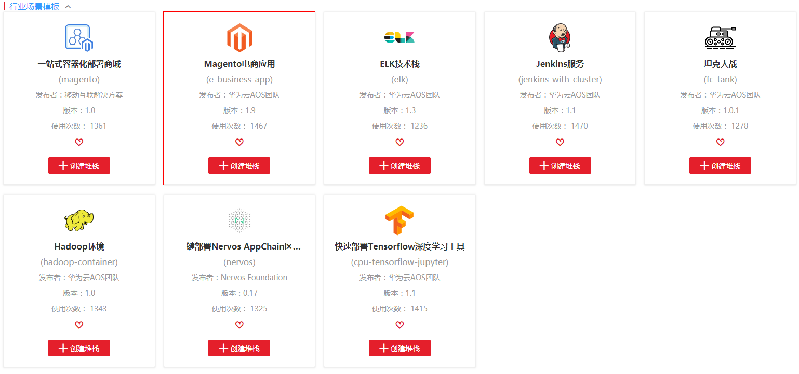
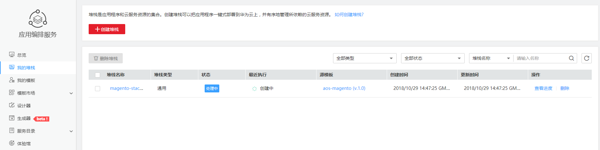

# 示例<a name="aos_02_0008"></a>

本节通过公共模板调用AOS 的API编排部署Magento电子商务系统，介绍使用AOS API的基本流程。

创建出来的Magento电子商务系统如下所示。

**图 1**  Magento电子商务系统<a name="fig95042014192113"></a>  


创建Magento电子商务系统的流程如下：

1.  调用[Token认证](获取请求认证.md#zh-cn_topic_0091607401_section2417768214391)接口获取用户Token，因为在后续的在后续的请求中需要将Token放到请求消息头中作为认证。
2.  登录AOS控制台，下载**Magento电商应用**公共模板。调用[创建模板](创建模板.md)，上传**Magento电商应用**公共模板作为自己的模板。
3.  调用[创建模板](创建模板.md)，上传**Magento电商应用**模板。
4.  调用[创建堆栈](创建堆栈.md)接口创建堆栈，创建Magento电子商务系统堆栈。
5.  调用[查询堆栈输出](查询堆栈输出.md)接口，查询堆栈的输出。查看Magento电子商务系统。
6.  调用[删除堆栈](删除堆栈.md)接口，删除堆栈，清理资源。

## 前提条件<a name="section91264715102"></a>

-   已获取IAM和AOS的Endpoint，具体请参见[地区和终端节点](http://developer.huaweicloud.com/endpoint)。
-   已获取项目ID，具体请参见[获取项目ID](获取项目ID.md)。
-   已创建至少一个可用容器集群，且包含一个2C4G的可用节点。您可登录[CCE控制台](https://console.huaweicloud.com/cce2.0/?locale=zh-cn®ion=cn-north-1&agencyId=ac534616299047708bc3dae6435a53c2#/app/dashboard)，单击“资源管理 \> 节点管理“，查看到节点状态为“可用“，弹性IP已绑定。

    > **说明：**   
    >容器集群和节点可使用**编排部署容器集群**进行创建，详情请参见[编排部署容器集群](https://support.huaweicloud.com/zh-cn/bestpractice-aos/aos_bestpractice_0008.html)。  

    获取**集群ID**（可在**集群详情**页面获取）、该集群下可用的**命名空间**和可用节点的**弹性IP地址**。


## 上传模板<a name="section6162203173112"></a>

假设已获取前提条件中的信息为如下值（实际操作中您需要根据实际情况替换）：

-   IAM的Endpoint：iam.cn-north-1.myhuaweicloud.com
-   AOS的Endpoint：aos.cn-north-1.myhuaweicloud.com
-   区域的名称：“cn-north-1“
-   项目ID：c51567523b744d098a8a81ede51894ac

1.  调用其他接口前，需要调用[Token认证](获取请求认证.md#zh-cn_topic_0091607401_section2417768214391)获取token，并设置成环境变量。
    1.  获取token。

        其中加粗的蓝色字体部分，需要替换为真实的数据。

        -   username：华为云的用户账号。
        -   password：华为云的用户密码。
        -   domainname：若是子账号，请填写对应的主账号名称。若不是子账号，请与username保持一致。
        -   cn-north-1：此处以中国华北区1为例。

            ```
            curl -H "Content-Type:application/json" https://{iam_endpoint}/v3/auth/tokens -X POST -d'{ 
               "auth": { 
                 "identity": { 
                   "methods": [ 
                     "password" 
                   ], 
                   "password": { 
                     "user": { 
                       "name": "username", 
                       "password": "****", 
                       "domain": { 
                         "name": "domainname" 
                       } 
                     } 
                   } 
                 }, 
                 "scope": { 
                   "project": { 
                     "name": "cn-north-1" 
                   } 
                 } 
               } 
             }' –v -k
            ```


        响应Header中“X-Subject-Token“的值即为Token：
    
        ```
        X-Subject-Token:
        MIIDkgYJKoZIhvcNAQcCoIIDgzCCA38CAQExDTALBglghkgBZQMEAgEwgXXXXX...
        ```
    
    2.  使用如下命令将token设置为环境变量，方便后续事项。
    
        **export Token=**_\{__X-Subject-Token\}_
    
        **X-Subject-Token**即为上一步骤获取到的token，如下所示。
    
        ```
        export Token=MIIDkgYJKoZIhvcNAQcCoIIDgzCCA38CAQExDTALBglghkgBZQMEAgEwgXXXXX...
        ```
    
    3.  将API的入口地址设置为环境变量，方便后续事项。
    
        **export AOS\_Endpoint="https://**_aos.cn-north-1.myhuaweicloud.com_"


2.  登录AOS控制台，下载公共模板。
    1.  选择左侧导航栏的“模板市场“，点击“公共模板“。
    2.  在“行业场景模板”下，单击**Magento电商应用**名称，查看详情。

        **图 2**  选择公共模板<a name="fig1372884617273"></a>  
        

        在模板详情中，展示了该模板的概述，以及模板图示。magento应用组中包含了一个magento前台应用和mysql数据库应用。且magento依赖于mysql应用，需要将数据存储到mysql中。

    3.  单击“下载模板”，保存公共模板文件（例如，e-business-app.yaml）到本地。

3.  在本地编写**Magento电商应用**模板，保存到文件e-business-app.yaml中。
4.  上传模板文件e-business-app.yaml到执行curl命令的服务器的任一路径，例如/home/paas。
5.  进入服务器中模板文件所在路径，调用[创建模板](创建模板.md)，上传**Magento电商应用**公共模板作为自己的模板。

    **curl -k -X POST -H** **"X-Auth-Token: $\{Token\}"** **-F "resource=\{\\"name\\": \\"**_aos-magento_**\\",\\"description\\":\\"**_aos magento template_**\\",\\"version\\": \\"**_1.3_**\\"\}" -F "archive\_content=@**_e-business-app.yaml_**" -i "$\{AOS\_Endpoint\}/v2/templates"**

    命令中参数说明如下：

    -   name：模板名字。
    -   description：模板描述。
    -   version：模板版本。
    -   archive\_content：要上传的模板包。如果执行curl命令时，未进入到模板文件所在路径，可以在此处加上路径，例如模板文件**e-business-app.yaml**在**/home/paas**路径下，则命令为**archive\_content=@**_/home/paas/e-business-app.yaml_****

    ```
    HTTP/1.1 100 Continue
    ......
    {
      "id": "10185add-acde-cc18-b8dd-b3a87a1f484c"
    }p
    ```

    记录模板ID（10185add-acde-cc18-b8dd-b3a87a1f484c）作为后续创建堆栈时所用的模板。

6.  将模板ID设置为环境变量。

    **export TEMPLATE\_ID="**_10185add-acde-cc18-b8dd-b3a87a1f484c_**"**

7.  查看模板输入，作为后续创建堆栈时需要配置的输入参数的修改。

    **curl -k -X GET -H "X-Auth-Token: $\{Token\}" "$\{AOS\_Endpoint\}/v2/templates/$\{TEMPLATE\_ID\}/inputs"**

    此处是为了获取模板的输入以方便后续修改，同时也验证一下模板ID是否可用。

    ```
    {
     .......
      "app-name": {
        "default": "magento",
        "description": "应用名称",
        "immutable": false,
        "label": "magento",
        "usednodes": [
          "magento",
          "magento-service"
        ]
      },
      "magento-EIP": {
        "description": "magento服务对外暴露访问地址",
        "immutable": false,
        "label": "magento",
        "usednodes": [
          "magento-config"
        ]
      },
      "magento-EPORT": {
        "default": 32080,
        "description": "magento服务对外监听端口",
        "immutable": false,
        "label": "magento",
        "type": "integer",
        "usednodes": [
          "magento-config",
          "magento-service"
        ]
      },
      "mysql-database": {
        "default": "magento",
        "description": "mysql数据库服务为magento服务创建的database名称",
        "immutable": false,
        "label": "mysql",
        "usednodes": [
          "mysql-conf"
        ]
      },
      "mysql-password": {
        "default": "******",
        "description": "mysql数据库服务密码",
        "immutable": false,
        "label": "mysql",
        "usednodes": [
          "mysql-conf"
        ]
      },
      "mysql-port": {
        "default": 3306,
        "description": "mysql数据库服务监听端口",
        "immutable": false,
        "label": "mysql",
        "type": "integer"
      },
     ......
    }
    ```

    在创建堆栈的时候需要填写这些值并最终转化为模板内的属性值，AOS后台在遇到未填写的字段的时候会使用模板内的默认值填写。本例需要更改magento-EIP和magento-EPORT的参数值，其余参数保持默认即可。


## 创建堆栈<a name="section94879551965"></a>

假设已获取前提条件中的信息为如下值（实际操作中您需要根据实际情况替换）：

-   项目ID：c51567523b744d098a8a81ede51894ac
-   CCE集群ID：f2637630-5d83-11e8-a6de-0255ac101a0c
-   命名空间：default
-   节点的弹性IP地址：10.154.78.102

1.  调用[创建堆栈](创建堆栈.md)接口，创建堆栈。

    ```
    curl -k -X POST -H "X-Auth-Token: ${Token}" -d '{
    "name": "magento-stack-test",
    "project_id": "c51567523b744d098a8a81ede51894ac",
    "template_id": "'"${TEMPLATE_ID}"'",
    "force": true,
    "cluster_id": "f2637630-5d83-11e8-a6de-0255ac101a0c",
    "namespace": "default",
    "inputs_json": {
    "magento-EIP": "10.154.78.102",
    "magento-EPORT": 32080
    },
    "action_parameters": {
    "auto_create": true,
    "timeout": 20
    }
    }' "${AOS_Endpoint}/v2/stacks"
    ```

    命令中参数说明如下：

    -   **name：**自定义堆栈名称，例如_magento-stack-test_
    -   **project\_id：**前提条件中获取到的项目ID

    -   **cluster\_id：**前提条件中获取到的集群ID
    -   **namespace：**前提条件中获取到的命名空间

    -   **magento-EIP：**前提条件中获取到的节点的弹性IP
    -   **magento-EPORT：**节点端口，请输入30000-32767之间的整数，请保证集群内唯一。可保持默认32080。

    创建成功的时候会返回堆栈相关的一些信息，为了后续操作，需要记录下堆栈的id。

    ```
    {
      "force": true,
      "guid": "0cec7a8c-5fc1-11e8-a532-0242ac110007",
      "namespace": "default",
      "project_id": "c51567523b744d098a8a81ede51894ac",
      "cluster_name": "k8s19-lm-do-not-delete",
      "cluster_id": "f2637630-5d83-11e8-a6de-0255ac101a0c",
      "domain_id": "b0148a2cb4f347289b477bab429e48e7",
      "name": "magento-stack-test",
      "description": "",
      "status": "",
      "template_id": "10185add-acde-cc18-b8dd-b3a87a1f484c",
      "previous_template_id": "",
      "template_name": "aos-magento",
      "inputs_json": "......",
      ......
    }
    ```

2.  将堆栈ID设置为环境变量。

    **export STACK\_ID="**_0cec7a8c-5fc1-11e8-a532-0242ac110007_**"**

3.  **magento-stack-test**堆栈成功创建的同时，可以在AOS控制台上看到状态为“处理中”的堆栈。

    **图 3**  堆栈状态为“处理中”<a name="fig39471546171912"></a>  
    

4.  调用[查询堆栈](查询堆栈.md)接口，查看堆栈创建是否成功。

    **curl -k -X GET -H "X-Auth-Token: $\{Token\}" "$\{AOS\_Endpoint\}/v2/stacks/$\{STACK\_ID\}"**

    ```
    {"force":true,"guid":"0cec7a8c-5fc1-11e8-a532-0242ac110007","namespace":"default","project_id":"c51567523b744d098a8a81ede51894ac","cluster_name":"k8s19-lm-do-not-delete","cluster_id":"f2637630-5d83-11e8-a6de-0255ac101a0c","domain_id":"b0148a2cb4f347289b477bab429e48e7","name":"magento-stack-test","description":"","status":"Running","template_id":"10185add-acde-cc18-b8dd-b3a87a1f484c","previous_template_id":"","template_name":"aos-magento","inputs_json":......}
    ```

    当返回接口中的status字段为Running状态时表示创建成功。如果创建失败可以通过subObjectStatuses字段查看错误日志。


## 访问Magento电子商务系统<a name="section134938556616"></a>

1.  调用[查询堆栈输出](查询堆栈输出.md)接口，查询堆栈的输出。

    **curl -k -X GET -H "X-Auth-Token: $\{Token\}" "$\{AOS\_Endpoint\}/v2/stacks/$\{STACK\_ID\}/outputs"**

    ```
    {"outputs":{"ingress-admin_password":{"value":"******","description":"Password of super user."},"magento-addr":{"value":"http://10.154.78.102:32080","description":"Access URL for magento service."},"magento-admin_username":{"value":"admin","description":"Super user name."}}}
    ```

2.  访问magento电子商务系统，在浏览器中访问地址**http://**_magento-EIP_**:**_magento-EPORT_，例如http://10.154.78.102:32080。

    **图 4**  访问magento电子商务系统<a name="fig579724016217"></a>  
    

    > **说明：**   
    >也可在AOS控制台，进入到magento-stack-test堆栈的“堆栈详情”页面“输出参数“页签中，获取“magento-addr“参数值，在浏览器中输入该值，访问magento电子商务系统。  


## 清理资源<a name="section1721134710314"></a>

为了防止您为不需要的服务付费，建议您删除堆栈，清理资源。

1.  调用[删除堆栈](删除堆栈.md)接口，删除堆栈。

    **curl -k -X DELETE -H "X-Auth-Token: $\{Token\}" "$\{AOS\_Endpoint\}/v2/stacks/$\{STACK\_ID\}"**

    ```
    {"action_id":"magento-stack-test-1777888820","last_action_id":"magento-stack-test-438555694"}
    ```

2.  执行删除堆栈命令后，调用[查询堆栈](查询堆栈.md)接口查询删除的进度，如果查询时状态码为404则表示删除成功。

    **curl -k -X GET -H "X-Auth-Token: $\{Token\}" "$\{AOS\_Endpoint\}/v2/stacks/$\{STACK\_ID\}"**

    ```
    {
      "message": "Resource Not Found",
      "code": "SVCSTG.AOS.4040013",
      "extend": "",
      "showdetail": false
    }
    ```


