# 了解云服务/元素

云服务也可称为元素，是设计器设计编排的基本单位，任何资源都含有其所在类别资源的所有属性。

设计器界面左侧对云服务资源进行了分类，任何云服务资源都可以拖拽到右侧的画布中。各云服务资源详细介绍请参见[资源索引](https://support.huaweicloud.com/tr-aos/aos_01_4012.html)中的元素列表。

## 如何复制/删除云服务？

云服务拖拽到画布中后，出现一个云服务，右键单击该云服务。

**图 1**  右键单击云服务  
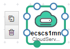

可查看到两个图标。单击可复制一个相同的云服务，单击可删除该云服务。

## 云服务框图类型

云服务中的资源框图目前有三类：

-   第一类：实线不可伸缩元素

    代表element元素，一般为终端服务或具体实体资源。该种类型元素不能通过拖拽方式调整框图大小。

    **图 2**  实线不可伸缩元素  
    

-   第二类：实线可伸缩元素

    代表container元素，在container中可放置element资源。该种类型元素可通过拖拽方式调整框图大小。

    **图 3**  实线可伸缩元素  
    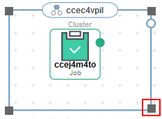

-   第三类：虚线不可以伸缩元素

    代表policy元素，例如APM.Pinpoint、AntiDDos.Service。该种类型元素不能通过拖拽方式调整框图大小。

    **图 4**  虚线不可以伸缩元素  
    

## 连接资源（点/线）

部分元素拖拽到画布中时，会看到资源上出现“点”。点分为“实心点“和“空心点“。

可以通过点来连接其他资源，两个资源之间的连接线代表关联关系或依赖关系。线分为“虚线”和“实线”。

-   虚线连接线

    从元素实心点上连接出来的连接线代表该种策略作用于目标元素。

    例如，拖拽APM.Pinpoint、ServiceStage.Job到画布中。

    **图 5**  APM.Pinpoint和ServiceStage.Job  
    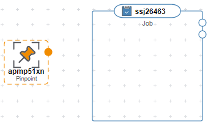

    鼠标移动到APM.Pinpoint的实心点上，单击该实心点，会出现一个箭头，拖动鼠标，将箭头挪动到ServiceStage.Job上。ServiceStage.Job会变成绿色状态，放开鼠标。表示左侧的策略作用于右侧资源。

    **图 6**  虚线连接线-连接元素  
    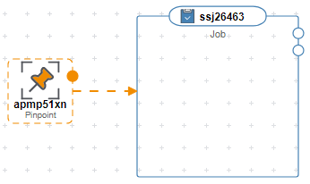

-   实心点连接线

    从元素实心点上连接出来的连接线代表元素与元素的依赖关系。更多内容请参见[实心点](#li561615170458)。

    **图 7**  实心点连接线  
    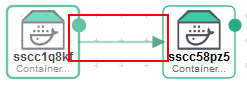

-   空心点连接线

    从元素空心点上连接出来的连接线代表元素与元素之间通过某个属性值进行关联（同时隐含两个元素之间有依赖关系）。更多内容请参见[空心点](#li16472174514349)。

    **图 8**  空心点连接线  
    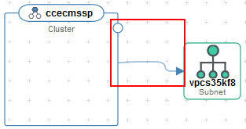

-   实心点

    表示带有实心点的资源，可依赖于其它资源。若拖拽的资源上出现实心点，表示这个资源可以依赖于其它资源。

    例如，拖拽ServiceStage.ContainerComponent（容器应用）到画布中，画布出现下图中的实心点。

    **图 9**  ServiceStage.ContainerComponent实心点  
    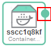

    移动鼠标到该实心点上，可查看到该点出现下图中属性值，表示ServiceStage.ContainerComponent这个资源只能依赖本身。

    **图 10**  ServiceStage.ContainerComponent属性  
    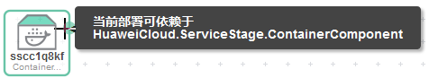

    以当前这个资源，依赖另一个ServiceStage.ContainerComponent为例。即A容器应用依赖于B容器应用。

    需要再拖拽一个ServiceStage.ContainerComponent到画布中。

    **图 11**  ServiceStage.ContainerComponent依赖  
    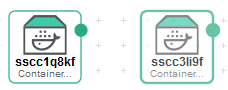

    鼠标移动到左侧资源的实心点上，单击该实心点，会出现一个箭头，此时可看到右侧的资源已转为绿色，表示可以连接到右侧资源中。拖动鼠标，将箭头拖动到右侧资源上，放开鼠标。表示左侧的资源依赖于右侧资源。

    **图 12**  实心点-连接元素  
    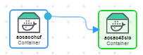

-   空心点

    表示带有空心点的资源，与其它资源可产生关联关系。若拖拽的资源上出现空心点，表示这个资源可以与其它资源产生关联关系。

    例如，拖拽CCE.Cluster（CCE集群）到画布中，画布中出现下图中的空心点。

    **图 13**  CCE.Cluster空心点  
    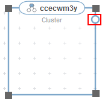

    移动鼠标到该空心点上，可查看到该点出现下图中的一个属性值。表示CCE.Cluster这个资源可以连接且只可以连接HUAWEICLOUD.VPC.Subnet元素，与之产生关联。

    **图 14**  CCE.Cluster属性  
    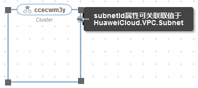

    以CCE.Cluster需要连接VPC.Subnet为例，需要先拖拽VPC.Subnet到画布中。

    **图 15**  VPC.Subnet  
    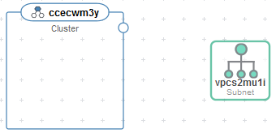

    鼠标移动到CCE.Cluster的空心点上，单击该空心点，会出现一个箭头，拖动鼠标，将箭头挪动到VPC.Subnet上。VPC.Subnet会变成绿色状态，放开鼠标。这两个资源的关联关系拖动完成。

    **图 16**  空心点-连接元素  
    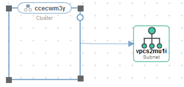

