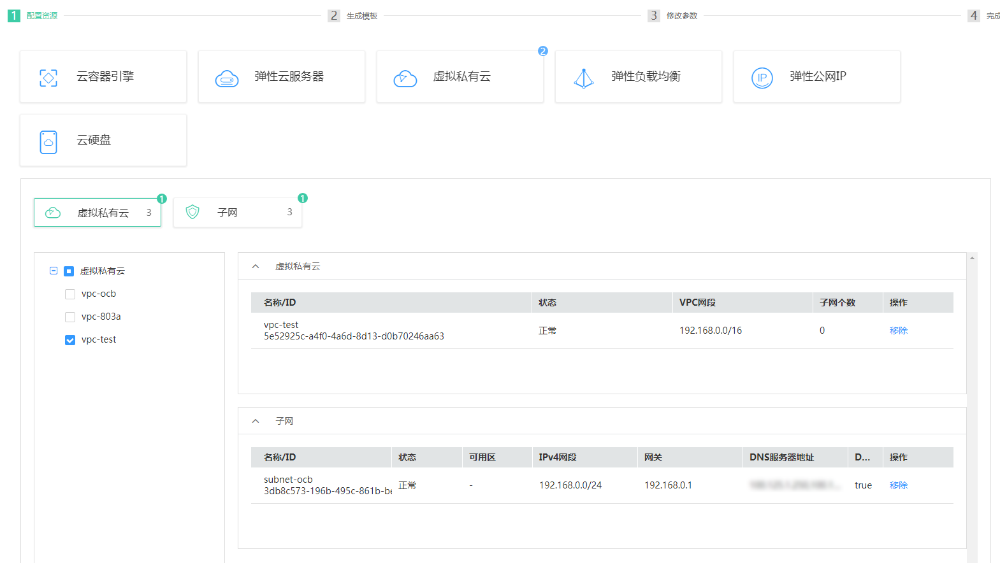

# 使用生成器

应用编排服务的生成器可帮助您对华为云上已有的资源对象进行统一建模，您可以挑选云上已有的资源，使用生成器一键生成模板。

当前支持生成模板的资源有：云容器引擎、弹性云服务器、虚拟私有云和子网、经典型负载均衡和增强型负载均衡、弹性公网IP和云硬盘（共享盘和非共享盘）。

本章节将以生成虚拟私有云和子网为例介绍使用生成器的操作步骤。

## 操作步骤

1.  登录AOS控制台。
2.  在左侧导航栏中，单击“生成器“。
3.  在右侧界面单击“生成模板“。
4.  选择虚拟私有云和子网，挑选已有资源。

    **图 1**  选择虚拟私有云和子网  
    

5.  单击“创建“生成模板。
6.  单击“修改模板参数“，填写模板名称和模板版本。
7.  单击“下一步“保存模板。

## 相关产品及文档

<table><thead align="left"><tr id="aos_01_0000_row61991225132314"><th class="cellrowborder" valign="top" width="50%" id="mcps1.1.3.1.1">
相关产品

</th>
<th class="cellrowborder" valign="top" width="50%" id="mcps1.1.3.1.2">
相关文档

</th>
</tr>
</thead>
<tbody><tr id="aos_01_0000_row152031825142310"><td class="cellrowborder" valign="top" width="50%" headers="mcps1.1.3.1.1 ">
<a href="https://www.huaweicloud.com/product/aos.html?infodoc1.0" target="_blank" rel="noopener noreferrer">应用编排服务 AOS</a>

<a href="https://www.huaweicloud.com/product/cce.html?infodoc1.0" target="_blank" rel="noopener noreferrer">云容器引擎 CCE</a>

<a href="https://www.huaweicloud.com/product/ecs.html?infodoc1.0" target="_blank" rel="noopener noreferrer">弹性云服务器 ECS</a>

<a href="https://www.huaweicloud.com/product/vpc.html?infodoc1.0" target="_blank" rel="noopener noreferrer">虚拟私有云 VPC</a>

</td>
<td class="cellrowborder" valign="top" width="50%" headers="mcps1.1.3.1.2 ">
<a href="https://support.huaweicloud.com/qs-aos/index.html?infodoc1.0" target="_blank" rel="noopener noreferrer">快速入门-通过公共模板创建资源堆栈</a>

<a href="https://support.huaweicloud.com/tr-aos/aos_01_4000.html?infodoc1.0" target="_blank" rel="noopener noreferrer">模板简介</a>

<a href="https://support.huaweicloud.com/usermanual-aos/aos_01_8011.html?infodoc1.0" target="_blank" rel="noopener noreferrer">堆栈管理</a>

<a href="https://support.huaweicloud.com/usermanual-aos/aos_01_5016.html?infodoc1.0" target="_blank" rel="noopener noreferrer">使用设计器</a>

<a href="https://support.huaweicloud.com/usermanual-aos/aos_01_5018.html?infodoc1.0" target="_blank" rel="noopener noreferrer">使用生成器</a>

</td>
</tr>
</tbody>
</table>

