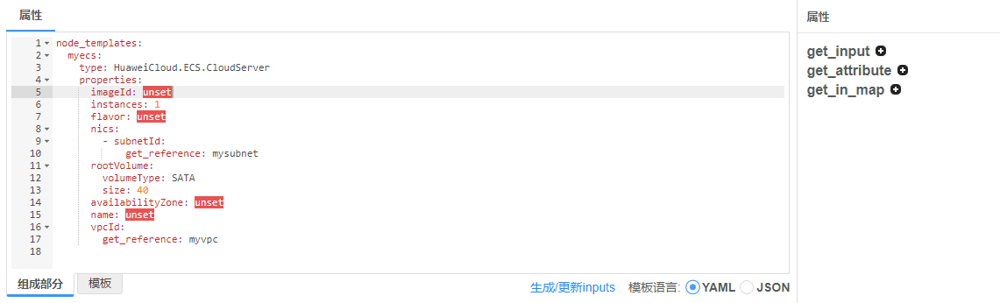
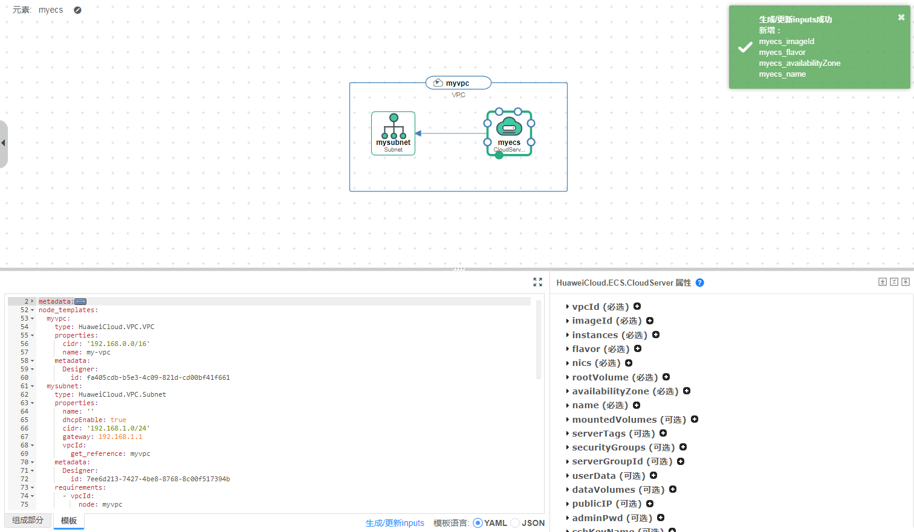
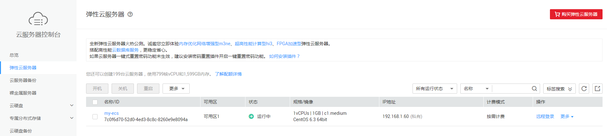

# 使用设计器编写模板创建弹性云服务器

上一教程介绍了通过**“**编写模板**”**创建弹性云服务器的步骤，本教程将指导您通过**“使用设计器编写模板”**创建弹性云服务器。本次教程完成后，在[云服务器控制台](https://console.huaweicloud.com/ecm/)中可查看到一个已创建好的弹性云服务器，如[图1](#fig1816145812355)。

**图 1**  弹性云服务器创建成功  

> **说明：**   
>本教程指导您“使用设计器编写模板“创建弹性云服务器（包括虚拟私有云和子网），建议您通过[使用设计器](https://support.huaweicloud.com/usermanual-aos/aos_01_5016.html)了解设计器的使用方法。若您需要了解“通过AOS设计器编排部署弹性云服务器的详细过程”，请参见[AOS最佳实践](http://support.huaweicloud.com/bestpractice-aos/aos_bestpractice_0013.html)。  

1.  [使用设计器编写模板](#section1053019171495)：使用设计器添加并连接元素，用设计器集成的编辑器为各元素添加参数。
2.  [创建弹性云服务器](#section9944142113311)：使用设计器创建弹性云服务器、虚拟私有云和子网。
3.  [清除资源](#section47381744143918)：为了防止您为不需要的服务付费，建议您删除堆栈，清理资源。

## 使用设计器编写模板

1.  登录AOS控制台，选择左侧导航栏的“设计器“。
2.  添加并连接元素。将VPC.VPC、VPC.Subnet、ECS.CloudServer元素拖放到画布中，改变元素名称为myvpc、mysubnet、myecs，并建立它们之间的关联关系，如[图2](#fig7679604409)。

    **图 2**  添加并连接元素  
    

3.  配置模板参数。用集成的编辑器为各元素添加参数，以便您可以在创建堆栈时指定输入值。
    1.  鼠标单击画布中的myvpc元素，在属性窗口中会自动显示该元素的属性，设置VPC名称为my-vpc，cidr可使用默认值192.168.0.0/16。

    1.  鼠标单击画布中的mysubnet元素，在属性窗口中会自动显示该元素的属性。设置子网名称为my-subnet，其他属性可使用默认值。
    2.  鼠标单击画布中的myecs元素，在属性窗口中会自动显示该元素的属性。属性值标记为**“unset“**的为未设置的属性（imageId、flavor、availabilityZone和name），如[图3](#fig14520541174015)。点击未设置的属性，在右侧属性栏中选择插入get\_input，其他属性可保留默认值。

        **图 3**  未设置的元素属性  
        

        > **说明：**   
        >为方便参数可配置可修改，建议经常变动的值使用输入参数。get\_input表示输入参数，get\_input后面定义的值可以自定义。  

    3.  鼠标单击画布下方“生成/更新inputs“，生成输入参数，如[图4](#fig1014892454812)。输入参数是从前面步骤的get\_input值中获取的。鼠标单击画布的空白区域，属性窗口处会出现输入页签，单击“输入“页签，可查看并修改输入参数。

        **图 4**  生成/更新inputs  
        

4.  单击设计器页面顶部的，校验模板是否正确。在界面左侧“操作日志“窗口中若出现“校验模板成功“，表示模板正确。
5.  单击设计器页面顶部的，选择“我的模板“，输入模板名称和版本，单击“保存“。
    -   模板名称：自定义模板名称，需确保全局唯一，例如设置为myecs。
    -   版本：1.0，保持默认。

## 创建弹性云服务器

1.  单击设计器页面右上侧的，进入AOS控制台首页。
2.  在左侧导航栏中，选择“我的模板“。在模板列表中可查看到保存成功的模板myecs。
3.  单击myecs模板后的“部署堆栈“。
4.  输入堆栈信息。
    -   堆栈名称：自定义堆栈名称，例如aos-ecs。
    -   描述：可不填写。
    -   配置输入参数：填写imageId、flavor、availabilityZone和name参数的值。

5.  单击“下一步“，查看堆栈信息，确认无误后，单击“创建堆栈“。

    系统自动跳转到堆栈详情页面，可查看到当前堆栈为创建中。此处创建了虚拟私有云VPC、子网Subnet以及一台弹性云服务器ECS。预计需要5分钟左右创建成功。

6.  待堆栈状态为“正常“时，可查看到堆栈元素中已有三个云服务。虚拟私有云、子网和弹性云服务器已创建成功。

    **图 5**  堆栈创建成功  
    

7.  查看已创建的云服务。
    1.  登录华为云控制台。
    2.  选择“计算 \> 弹性云服务器“，可查看到已创建成功一台ECS。

        **图 6**  ECS创建成功  
        

    3.  选择“网络 \> 虚拟私有云“，可查看到已创建成功的VPC。

        **图 7**  VPC创建成功  
        

    4.  单击该VPC名称，进入详情页面，可查看到对应的子网已创建成功。

        **图 8**  子网创建成功  
        

## 清除资源

为了防止您为不需要的服务付费，建议您删除堆栈，清理资源。

1.  登录AOS控制台。
2.  在左侧导航栏中，单击“我的堆栈”。
3.  勾选已创建成功的应用堆栈，单击“删除堆栈“，根据界面提示删除堆栈。

## 相关产品及文档

<table><thead align="left"><tr id="row61991225132314"><th class="cellrowborder" valign="top" width="50%" id="mcps1.1.3.1.1">
相关产品

</th>
<th class="cellrowborder" valign="top" width="50%" id="mcps1.1.3.1.2">
相关文档

</th>
</tr>
</thead>
<tbody><tr id="row152031825142310"><td class="cellrowborder" valign="top" width="50%" headers="mcps1.1.3.1.1 ">
<a href="https://www.huaweicloud.com/product/aos.html?infodoc1.0" target="_blank" rel="noopener noreferrer">应用编排服务 AOS</a>

<a href="https://www.huaweicloud.com/product/ecs.html?infodoc1.0" target="_blank" rel="noopener noreferrer">弹性云服务器 ECS</a>

<a href="https://www.huaweicloud.com/product/vpc.html?infodoc1.0" target="_blank" rel="noopener noreferrer">虚拟私有云 VPC</a>

</td>
<td class="cellrowborder" valign="top" width="50%" headers="mcps1.1.3.1.2 ">
<a href="https://support.huaweicloud.com/bestpractice-aos/aos_bestpractice_0013.html?infodoc1.0" target="_blank" rel="noopener noreferrer">最佳实践-编排部署弹性云服务器</a>

<a href="https://support.huaweicloud.com/qs-aos/index.html?infodoc1.0" target="_blank" rel="noopener noreferrer">快速入门-通过公共模板创建资源堆栈</a>

<a href="https://support.huaweicloud.com/tr-aos/aos_01_4000.html?infodoc1.0" target="_blank" rel="noopener noreferrer">模板简介</a>

<a href="https://support.huaweicloud.com/usermanual-aos/aos_01_8011.html?infodoc1.0" target="_blank" rel="noopener noreferrer">堆栈管理</a>

<a href="https://support.huaweicloud.com/usermanual-aos/aos_01_5016.html?infodoc1.0" target="_blank" rel="noopener noreferrer">使用设计器</a>

<a href="https://support.huaweicloud.com/usermanual-aos/aos_01_5018.html?infodoc1.0" target="_blank" rel="noopener noreferrer">使用生成器</a>

</td>
</tr>
</tbody>
</table>

