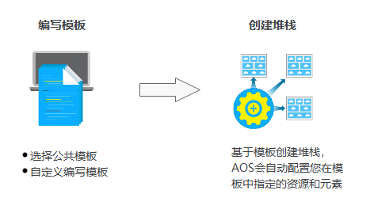

# 欢迎使用应用编排服务

感谢您更深入的了解、学习并使用应用编排服务AOS。

通过AOS部署应用上云流程非常简单，您只需要编写好模板，并基于该模板创建堆栈，如[图1](#fig718916910237)。同时，AOS还提供了应用生命周期管理能力，如启动、变更、删除等。

**图 1**  AOS使用流程  

**表 1**  AOS使用流程说明

<table><thead align="left"><tr id="row142229468173"><th class="cellrowborder" valign="top" width="15%" id="mcps1.2.3.1.1">
步骤

</th>
<th class="cellrowborder" valign="top" width="85%" id="mcps1.2.3.1.2">
说明

</th>
</tr>
</thead>
<tbody><tr id="row72221846191715"><td class="cellrowborder" valign="top" width="15%" headers="mcps1.2.3.1.1 ">
1. 编写模板

</td>
<td class="cellrowborder" valign="top" width="85%" headers="mcps1.2.3.1.2 ">
模板是一种遵循AOS语法规范的文本文件，描述了应用属性、云服务配置、应用与云服务之间的依赖关系。

编写模板的方式：

<ul id="ul9146134615158"><li><strong id="b71478462153">选择公共模板：</strong>AOS提供了多个公共模板，您可以基于公共模板来快速创建堆栈。
通过<strong id="b1314711461153">“<strong id="b314784651519">选择公共模板</strong>”</strong>编排部署资源的方法请参见<a href="https://support.huaweicloud.com/qs-aos/index.html" target="_blank" rel="noopener noreferrer">通过公共模板创建资源堆栈</a>。

</li><li><strong id="b1714610467158">自定义编写模板：</strong>您可以使用JSON或YAML格式来写作模板。独立编写模板前，建议您先通过<a href="https://support.huaweicloud.com/tr-aos/aos_01_4000.html" target="_blank" rel="noopener noreferrer">模板参考</a>来初步学习一下。自定义编写模板有两种方式，一种是直接在界面手动输入；另一种是在本地编辑，编辑完之后通过上传文件传到系统中。
通过<strong id="b6147546131514">“<strong id="b2014724611517">自定义编写模板</strong>”</strong>编排部署资源的方法请参见<a href="https://support.huaweicloud.com/qs-aos/aos_qs_0002.html" target="_blank" rel="noopener noreferrer">通过编写模板创建弹性云服务器</a>。

 须知： 

YAML语法不支持使用Tab键，层次关系需要使用<strong id="b15420185651512">空格</strong>来对齐（空格个数为2的整数倍，如2、4、6、8等）。初次使用时，经常会遇到此类错误，请注意。

</li></ul>
<ul id="ul1414711469152"><li><strong id="b914715462158">使用设计器创建模板：</strong>自定义编写模板比较难以上手，通过设计器可以简化模板的撰写和编辑工作，并可以直接可视化查看各资源的关系。建议您通过<a href="什么是设计器.md">使用设计器</a>了解设计器的使用方法。
通过<strong id="b0147194611154">“<strong id="b114724611159">使用设计器创建模板</strong>”</strong>编排部署资源的方法请参见<a href="https://support.huaweicloud.com/qs-aos/aos_qs_0003.html" target="_blank" rel="noopener noreferrer">通过设计器编写模板创建弹性云服务器</a>。

</li></ul>

关于模板的更多信息请参阅<a href="https://support.huaweicloud.com/tr-aos/aos_01_4000.html" target="_blank" rel="noopener noreferrer">模板参考</a>。

</td>
</tr>
<tr id="row18222646191713"><td class="cellrowborder" valign="top" width="15%" headers="mcps1.2.3.1.1 ">
2.创建堆栈

</td>
<td class="cellrowborder" valign="top" width="85%" headers="mcps1.2.3.1.2 ">
堆栈是应用程序、云服务资源的集合。堆栈将应用、云服务作为一个整体来进行创建、删除等。

您可以基于模板创建堆栈，AOS会自动配置您在模板中指定的资源和元素。

有关堆栈的更多信息请参阅<a href="堆栈管理.md">堆栈管理</a>。

</td>
</tr>
</tbody>
</table>

