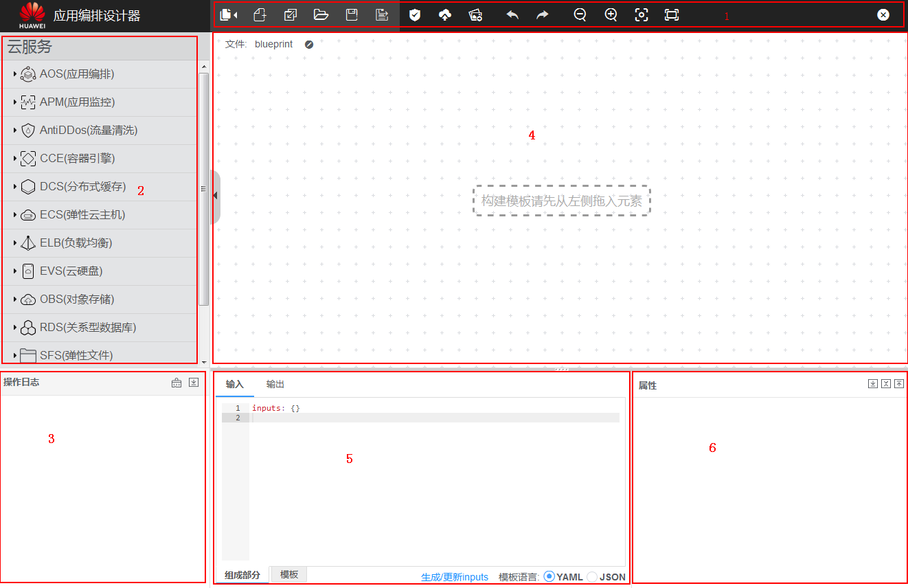

# 设计器界面概述

应用编排服务的设计器界面由六个部分组成，分别是控制栏、资源栏、日志栏、设计台、模板栏和属性栏。设计器各部分详细功能说明如[图1](#fig122088245130)。

**图 1**  设计器界面  

**表 1**  编排设计器页面说明

<table><thead align="left"><tr id="row7807155420280"><th class="cellrowborder" valign="top" width="17.990000000000002%" id="mcps1.2.3.1.1">
编号（对应上图）

</th>
<th class="cellrowborder" valign="top" width="82.01%" id="mcps1.2.3.1.2">
解释

</th>
</tr>
</thead>
<tbody><tr id="row11807165482818"><td class="cellrowborder" valign="top" width="17.990000000000002%" headers="mcps1.2.3.1.1 ">
1

</td>
<td class="cellrowborder" valign="top" width="82.01%" headers="mcps1.2.3.1.2 ">
控制栏，集中显示设计台的快捷控制操作。

</td>
</tr>
<tr id="row98081545284"><td class="cellrowborder" valign="top" width="17.990000000000002%" headers="mcps1.2.3.1.1 ">
2

</td>
<td class="cellrowborder" valign="top" width="82.01%" headers="mcps1.2.3.1.2 ">
资源栏，展示所有可被拖动设计的资源。各资源按照其所属的服务进行分类。

您可以把想要编排的资源拖动到设计台画布，并运用其生成的连接点进行逻辑关系的定义与关联。

</td>
</tr>
<tr id="row834316598396"><td class="cellrowborder" valign="top" width="17.990000000000002%" headers="mcps1.2.3.1.1 ">
3

</td>
<td class="cellrowborder" valign="top" width="82.01%" headers="mcps1.2.3.1.2 ">
日志栏，展示用户在操作或设计模板过程中所触发的错误信息、提示信息等。

例如，将模板由JSON格式切换成YAML格式时，日志栏会提示您已将模板成功转换为YAML格式。

</td>
</tr>
<tr id="row8651928400"><td class="cellrowborder" valign="top" width="17.990000000000002%" headers="mcps1.2.3.1.1 ">
4

</td>
<td class="cellrowborder" valign="top" width="82.01%" headers="mcps1.2.3.1.2 ">
设计台，用户设计模板的主要操作画布，用于连接资源之间的关系。

</td>
</tr>
<tr id="row9835169174012"><td class="cellrowborder" valign="top" width="17.990000000000002%" headers="mcps1.2.3.1.1 ">
5

</td>
<td class="cellrowborder" valign="top" width="82.01%" headers="mcps1.2.3.1.2 ">
模板栏，设计过程中动态生成相应的模板，阐明其资源之间的关系，支持模板修改和属性定义。

</td>
</tr>
<tr id="row15641637134915"><td class="cellrowborder" valign="top" width="17.990000000000002%" headers="mcps1.2.3.1.1 ">
6

</td>
<td class="cellrowborder" valign="top" width="82.01%" headers="mcps1.2.3.1.2 ">
属性帮助栏，释放一个拖动资源或选中一个拖动资源时，属性栏会展示您所选中资源所包含的属性名、属性类型，便于您在模板栏进行属性编写或定义时做参照。

</td>
</tr>
</tbody>
</table>

建议您通过[AOS最佳实践](https://support.huaweicloud.com/bestpractice-aos/aos_bestpractice_0013.html)，学习如何使用设计器。

