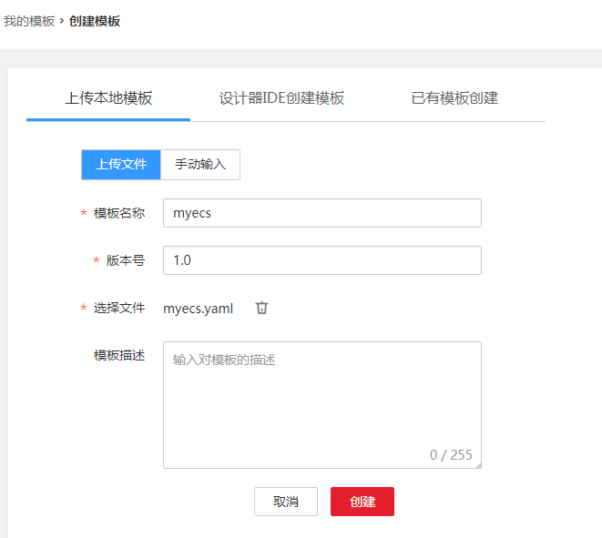
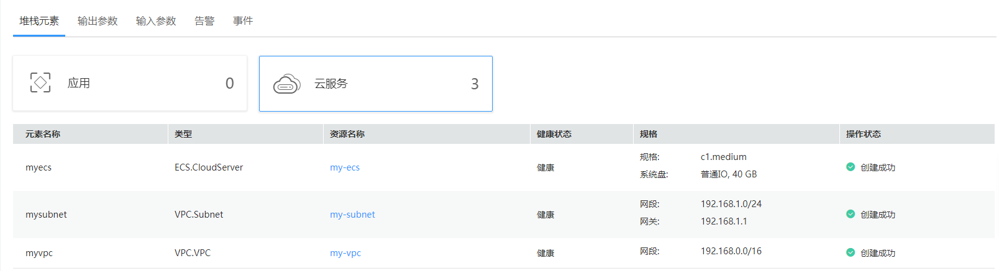
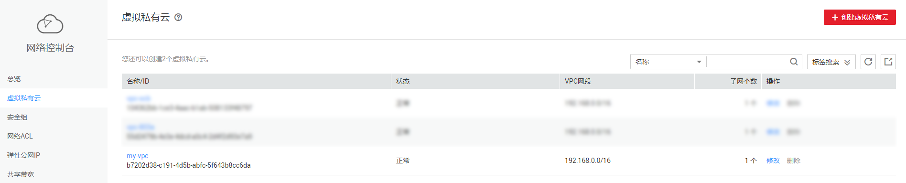
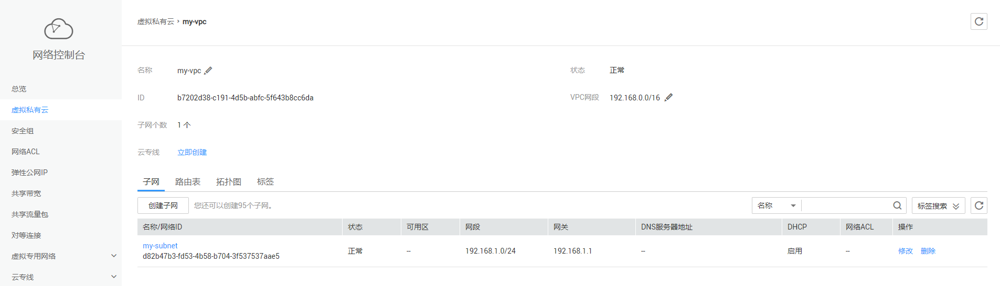

# 通过编写模板创建弹性云服务器<a name="aos_01_2002"></a>

本教程指导您通过**“**编写模板**”**创建弹性云服务器（包括虚拟私有云和子网）。弹性云服务器（Elastic Cloud Server，简称ECS）是由CPU、内存、镜像、云硬盘组成的一种可随时获取、弹性可扩展的计算云服务器。虚拟私有云可以为您的弹性云服务器构建隔离的、用户自主配置和管理的虚拟网络环境。创建虚拟私有云时可以同时创建一个或多个子网。

本次教程完成后，在[云服务器控制台](https://console.huaweicloud.com/ecm/)中可查看到一个已创建好的弹性云服务器，如[图1](#fig1816145812355)。

**图 1**  弹性云服务器已创建<a name="fig1816145812355"></a>  


> **说明：**   
>本教程以“编写模板“为例介绍创建模板的方法，您还可以“使用公共模板“或“通过设计器创建模板“。关于模板的更多信息请参阅[模板参考](https://support.huaweicloud.com/tr-aos/aos_01_4000.html)。  

在此入门中，您将完成以下步骤：

1.  [编写模板](#section722416231947)：用yaml语言编写创建弹性云服务器、虚拟私有云和子网的模板。
2.  [创建弹性云服务器](#section458524113314)：使用模板创建弹性云服务器、虚拟私有云和子网。
3.  [清除资源](#section13579658163417)：为了防止您为不需要的服务付费，建议您删除堆栈，清理资源。

## 编写模板<a name="section722416231947"></a>

1.  首先编写一个简单的模板创建虚拟私有云：

    ```
    tosca_definitions_version: huaweicloud_tosca_version_1_0   #模板的版本信息
    node_templates:                 #元素对象定义
      myvpc:                        #元素名称
        type: HuaweiCloud.VPC.VPC   #元素类型
        properties:                 #元素属性
          name: my-vpc              #虚拟私有云的名称
          cidr: '192.168.0.0/16'    #虚拟私有云的网段
    ```

    模板主要包括如下几部分：

    1.  tosca\_definitions\_version：用于标识模板的版本信息。当前AOS支持的版本为huaweicloud\_tosca\_version\_1\_0。
    2.  node\_templates：用于定义该模板中编排的元素对象集合，其中所有对象均为元素（可以是一个应用、一个云服务资源）。上述模板中node\_templates定义了一个虚拟私有云myvpc。
    3.  type：用于指定编排对象的具体类型，来自元素类型列表，可设置为HuaweiCloud.\*\*\*（\*\*\*为[资源索引](https://support.huaweicloud.com/tr-aos/aos_01_4012.html)中元素名）。上述模板中定义的虚拟私有云myvpc为HuaweiCloud.VPC.VPC类型。
    4.  properties：用于定义元素属性，不同的元素类型会有不同的属性。上述模板中虚拟私有云myvpc具有两个属性name和cidr，分别表示虚拟私有云的名称和虚拟私有云的网段，更多信息请参阅[虚拟私有云VPC](https://support.huaweicloud.com/tr-aos/vpc-vpc.html)。

2.  VPC网段范围比较大，可以在VPC中定义一个子网，子网是VPC的IP地址范围内的一个区段。基于上个模板在创建的VPC中定义一个子网：

    ```
    tosca_definitions_version: huaweicloud_tosca_version_1_0   #模板的版本信息
    node_templates:                 #元素对象定义
      myvpc:                        #虚拟私有云
        type: HuaweiCloud.VPC.VPC   
        properties:                 
          name: my-vpc              #虚拟私有云的名称
          cidr: '192.168.0.0/16'    #虚拟私有云的网段
      mysubnet:
        type: HuaweiCloud.VPC.Subnet
        properties:
          name: my-subnet           #子网的名称
          cidr: '192.168.1.0/24'    #子网的网段
          gateway: 192.168.1.1      #子网的网关
          vpcId:                    #子网所属VPC的ID
            get_reference: myvpc
          dhcpEnable: true          #是否为该VPC的子网开启DHCP功能
        requirements:               #定义子网与vpc的依赖关系
          - vpcId:
              node: myvpc
    ```

    requirements为元素依赖，用于设置为与该元素存在依赖关系的其他元素名称。例如子网依赖VPC，模板中在子网的requirements中定义依赖的node为myvpc。

3.  在模板中定义弹性云服务器：

    ```
    tosca_definitions_version: huaweicloud_tosca_version_1_0   #模板的版本信息
    node_templates:                 #元素对象定义
      myvpc:                        #虚拟私有云
        type: HuaweiCloud.VPC.VPC   
        properties:                 
          name: my-vpc              #虚拟私有云的名称
          cidr: '192.168.0.0/16'    #虚拟私有云的网段
      mysubnet:                     #子网
        type: HuaweiCloud.VPC.Subnet
        properties:
          name: my-subnet           #子网的名称
          cidr: '192.168.1.0/24'    #子网的网段
          gateway: 192.168.1.1      #子网的网关
          vpcId:                    #子网所属VPC的ID
            get_reference: myvpc
          dhcpEnable: true          #是否为该VPC的子网开启DHCP功能
        requirements:               #定义子网与VPC的依赖关系
          - vpcId:
              node: myvpc
      myecs:                        #弹性云服务器
        type: HuaweiCloud.ECS.CloudServer    
        properties:       
          name: my-ecs              #云服务器名称
          instances: 1              #创建云服务器数量
          imageId: a3934478-bfeb-4a02-b257-9089779f0380    #云服务器使用的镜像ID，本模板中设置为ECS系统盘镜像CentOS 6.3 64bit的镜像ID  
          flavor: c1.medium         #云服务器的规格
          vpcId:                    #云服务器所属VPC的ID，支持使用已有或新建虚拟私有云ID
            get_reference: myvpc    #用于获取相关联的元素的动态属性值
          availabilityZone: cn-south-1a      #云服务器对应可用分区信息，本模板中使用的是华南-广州区域的一个可用分区
          nics:                              #云服务器对应的网卡信息
            - subnetId: 
                get_reference: mysubnet      
          rootVolume:              #云服务器对应系统盘相关配置
            volumeType: SATA       #普通IO磁盘类型
            size: 40               #系统盘大小，容量单位为GB
        requirements:              #定义弹性云服务器和VPC、子网的依赖关系
          - vpcId:         
              node: myvpc      
          - nics.subnetId:          
              node: mysubnet
    ```

4.  将模板保存为本地文件myecs.yaml。
5.  登录AOS控制台。

    > **说明：**   
    >模板中云服务器的镜像ID和可用分区使用的是华南-广州区域的CentOS 6.3 64bit的镜像ID和cn-south-1a分区，因此登录控制台时请选择华南-广州区域，否则会导致堆栈创建失败。  

6.  选择左侧导航栏的“我的模板“，单击“创建模板“。
7.  选择“上传本地模板“，上传本地yaml文件，单击“创建“，系统自动跳转到模板详情页面，可查看到当前模板信息。
    -   模板名称：自定义模板名称，需确保全局唯一，例如设置为myecs。
    -   版本：1.0，保持默认。
    -   选择文件：上传本地文件myecs.yaml。

        **图 2**  上传本地模板<a name="fig456104114716"></a>  
        


## 创建弹性云服务器<a name="section458524113314"></a>

1.  登录AOS控制台。
2.  在左侧导航栏中，选择“我的模板“。在模板列表中可查看到保存成功的模板myecs。
3.  单击myecs模板后的“部署堆栈“。
4.  设置堆栈信息。
    -   堆栈名称：输入堆栈名称，例如aos-ecs，需确保该值唯一。
    -   描述：可不填写。

5.  单击“下一步“，查看堆栈信息，确认无误后，单击“创建堆栈“。

    系统自动跳转到堆栈详情页面，可查看到当前堆栈为创建中。此处创建了虚拟私有云VPC、子网Subnet以及一台弹性云服务器ECS。预计需要5分钟左右创建成功。

6.  待堆栈状态为“正常“时，可查看到堆栈元素中已有三个云服务。虚拟私有云、子网和弹性云服务器已创建成功。

    **图 3**  堆栈已创建成功<a name="fig173331858104315"></a>  
    

7.  查看已创建的云服务。
    1.  登录华为云控制台。
    2.  选择“计算 \> 弹性云服务器“，可查看到已创建成功一台ECS。

        **图 4**  ECS已创建成功<a name="fig1185121116182"></a>  
        

    3.  选择“网络 \> 虚拟私有云“，可查看到已创建成功的VPC。

        **图 5**  VPC已创建成功<a name="fig389723152219"></a>  
        

    4.  单击该VPC名称，进入详情页面，可查看到对应的子网已创建成功。

        **图 6**  子网已创建成功<a name="fig776237182419"></a>  
        


## 清除资源<a name="section13579658163417"></a>

为了防止您为不需要的服务付费，建议您删除堆栈，清理资源。

1.  登录AOS控制台。
2.  在左侧导航栏中，单击“我的堆栈”。
3.  勾选已创建成功的应用堆栈，单击“删除堆栈“，根据界面提示删除堆栈。

## 相关产品及文档<a name="section1295120817234"></a>

<a name="table1196182515236"></a>
<table><thead align="left"><tr id="row61991225132314"><th class="cellrowborder" valign="top" width="50%" id="mcps1.1.3.1.1"><p id="p72001525172310"><a name="p72001525172310"></a><a name="p72001525172310"></a>相关产品</p>
</th>
<th class="cellrowborder" valign="top" width="50%" id="mcps1.1.3.1.2"><p id="p7201925132317"><a name="p7201925132317"></a><a name="p7201925132317"></a>相关文档</p>
</th>
</tr>
</thead>
<tbody><tr id="row152031825142310"><td class="cellrowborder" valign="top" width="50%" headers="mcps1.1.3.1.1 "><p id="p192041625182318"><a name="p192041625182318"></a><a name="p192041625182318"></a><a href="https://www.huaweicloud.com/product/aos.html?infodoc1.0" target="_blank" rel="noopener noreferrer">应用编排服务 AOS</a></p>
<p id="p62061025142316"><a name="p62061025142316"></a><a name="p62061025142316"></a><a href="https://www.huaweicloud.com/product/ecs.html?infodoc1.0" target="_blank" rel="noopener noreferrer">弹性云服务器 ECS</a></p>
<p id="p56849617152"><a name="p56849617152"></a><a name="p56849617152"></a><a href="https://www.huaweicloud.com/product/vpc.html?infodoc1.0" target="_blank" rel="noopener noreferrer">虚拟私有云 VPC</a></p>
</td>
<td class="cellrowborder" valign="top" width="50%" headers="mcps1.1.3.1.2 "><p id="p1951411271267"><a name="p1951411271267"></a><a name="p1951411271267"></a><a href="https://support.huaweicloud.com/bestpractice-aos/aos_bestpractice_0013.html?infodoc1.0" target="_blank" rel="noopener noreferrer">最佳实践-编排部署弹性云服务器</a></p>
<p id="p959019196593"><a name="p959019196593"></a><a name="p959019196593"></a><a href="https://support.huaweicloud.com/qs-aos/index.html?infodoc1.0" target="_blank" rel="noopener noreferrer">快速入门-通过公共模板创建资源堆栈</a></p>
<p id="p14446527862"><a name="p14446527862"></a><a name="p14446527862"></a><a href="https://support.huaweicloud.com/tr-aos/aos_01_4000.html?infodoc1.0" target="_blank" rel="noopener noreferrer">模板简介</a></p>
<p id="p15698421353"><a name="p15698421353"></a><a name="p15698421353"></a><a href="https://support.huaweicloud.com/usermanual-aos/aos_01_8011.html?infodoc1.0" target="_blank" rel="noopener noreferrer">堆栈管理</a></p>
<p id="p7211210322"><a name="p7211210322"></a><a name="p7211210322"></a><a href="https://support.huaweicloud.com/usermanual-aos/aos_01_5016.html?infodoc1.0" target="_blank" rel="noopener noreferrer">使用设计器</a></p>
<p id="p0481187193317"><a name="p0481187193317"></a><a name="p0481187193317"></a><a href="https://support.huaweicloud.com/usermanual-aos/aos_01_5018.html?infodoc1.0" target="_blank" rel="noopener noreferrer">使用生成器</a></p>
</td>
</tr>
</tbody>
</table>

