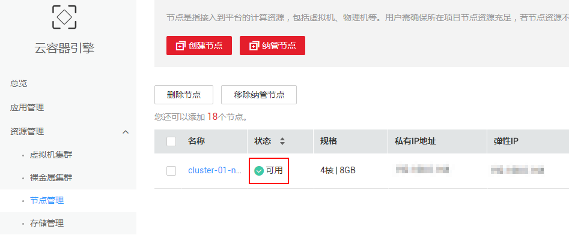
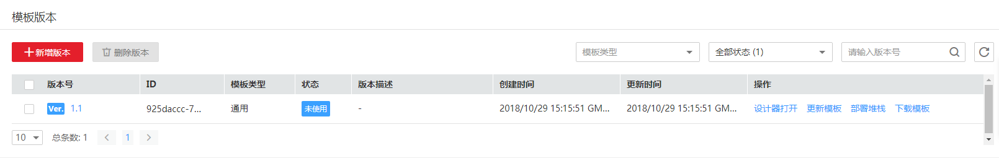
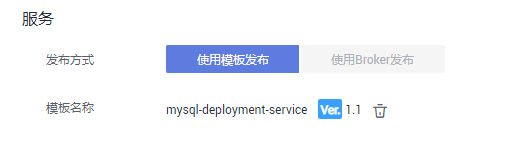
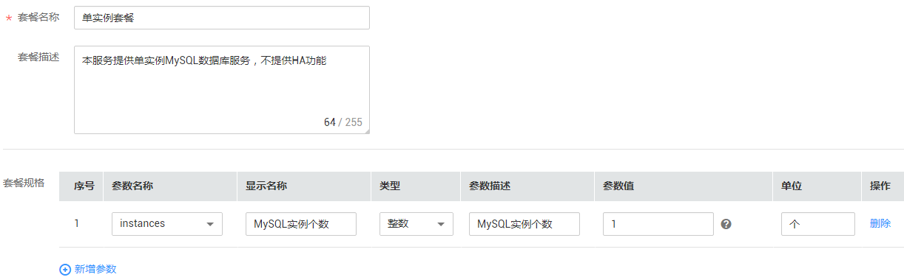
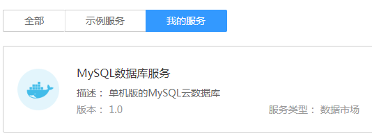
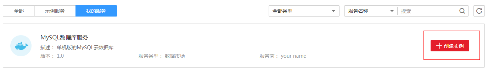
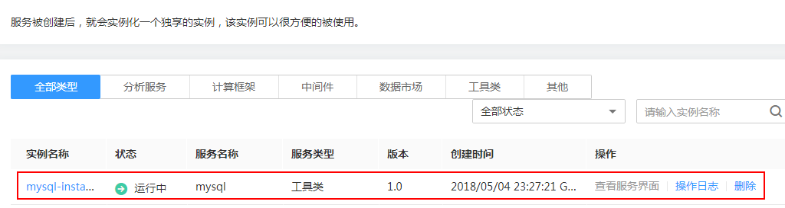

# （演练）开始发布服务<a name="aos_01_9017"></a>

本教程指导您通过AOS编排部署MySQL数据库。在此演练中，您将完成以下步骤：

1.  [前提条件](#zh-cn_topic_0109816522_section2827185213482)：部署容器前，需确保至少已包含一个可用集群和一个2C4G的节点。
2.  [编写MySQL模板文件](#zh-cn_topic_0109816522_section13336100105210)：编写MySQL数据库的部署模板文件。
3.  [编写服务描述文件](#zh-cn_topic_0109816522_section55871732121118)：定义当前服务的基本信息，文件中的参数用户可自定义。
4.  [新建模板](#zh-cn_topic_0109816522_section135471832143710)：使用编写好的MySQL模板文件来创建模板。
5.  [发布服务](#zh-cn_topic_0109816522_section79981111212)：将服务发布到AOS服务市场，允许其他使用者订购后使用。
6.  [订购服务](#zh-cn_topic_0109816522_section715951113123)：在服务市场中，选择需要的服务，并进行实例化。实例化后购买者即可使用该服务。

## 前提条件<a name="zh-cn_topic_0109816522_section2827185213482"></a>

已创建至少一个可用容器集群，且包含一个可用节点。

您可登录[CCE控制台](https://console.huaweicloud.com/cce2.0/?locale=zh-cn®ion=cn-north-1&agencyId=ac534616299047708bc3dae6435a53c2#/app/dashboard)，单击“资源管理 \> 节点管理“，查看到节点状态为“可用“。

**图 1**  集群和节点已创建<a name="zh-cn_topic_0109816522_fig123473288356"></a>  


## 编写MySQL模板文件<a name="zh-cn_topic_0109816522_section13336100105210"></a>

1.  打开文本编辑器工具，搭建模板框架。

    -   tosca\_definitions\_version：必选，无需修改，表示使用的基线模板版本。
    -   inputs：可选，描述模板输入参数。
    -   node\_templates：必选，描述模板元素。
    -   outputs：可选，描述模板输出参数。

    框架模板示例如下：

    ```
    tosca_definitions_version: huaweicloud_tosca_version_1_0
    inputs:
      ……
    node_templates:
      ……
    outputs:
      ……
    ```

2.  在node\_templates中定义元素。

    模板包含哪些元素，在node\_templates定义。node\_templates是模板的主要组成部分，定义完该部分后，模板已成为一个可运行的yaml或者json文件。

    ```
    node_templates:                 
      mysql-deployment:
        type: HuaweiCloud.CCE.Deployment
        properties:
          k8sManifest:
            apiVersion: apps/v1
            kind: Deployment
            metadata:
              labels:
                app: {get_input: serviceName}
              name: {get_input: serviceName}
            spec:
              replicas: {get_input: instances}
              selector:
                matchLabels:
                  app: {get_input: serviceName}
              template:
                metadata:
                  labels:
                    app: {get_input: serviceName}
                spec:    
                  imagePullSecrets:
                  - name: default-secret
                  containers:
                    - image: {get_input: mysqlImage}
                      name: {get_input: containerName}
                      env:
                        - name: MYSQL_DATABASE
                          value: {get_input: databaseName}
                        - name: MYSQL_ROOT_PASSWORD
                          value: {get_input: rootPassword}
                        - name: MYSQL_USER
                          value: {get_input: mysqlUser}
                        - name: MYSQL_PASSWORD
                          value: {get_input: userPassword}
                      ports:
                        - containerPort: {get_input: mysqlPort}
                      imagePullPolicy: {get_input: imagePullPolicy}
      mysql-service:
        type: HuaweiCloud.CCE.Service
        properties:
          k8sManifest:
            apiVersion: v1
            kind: Service
            metadata:
              name: {get_input: serviceName}
              labels:
                app: {get_input: serviceName}
            spec:
              ports: 
                - protocol: TCP
                  port: {get_input: mysqlPort}
                  targetPort: {get_input: mysqlPort}
              selector:
                app: {get_input: serviceName}
              sessionAffinity: None
              type: NodePort   
    ```

3.  定义inputs参数。

    此处定义的inputs参数，需要与node\_templates中定义的get\_input值相匹配。

    ```
    inputs:
      mysqlUser:
        default: testuser
      userPassword:
        default: ******
      rootPassword:
        default: ******
      mysqlImage:
        default: mysql
      databaseName:
        default: mydatabase
      mysqlPort:
        type: integer
        default: 3306
      serviceName:
        default: mysql-service
      instances:
        type: integer
        default: 1
      containerName:
        default: mysql-container
      imagePullPolicy:
        default: IfNotPresent
    ```

4.  定义outputs参数。

    ```
    outputs:
      mysql-addr:
        value: 
          concat:
          - {get_input: serviceName}
          - ".default.svc.cluster.local"
      mysql-port:
        value: {get_input: mysqlPort}
    ```

5.  生成模板。

    请将如下内容保存为yaml格式的文件，如**mysql-deployment-service.yaml**。

    ```
    tosca_definitions_version: huaweicloud_tosca_version_1_0
    
    inputs: #（一）模板可变量
      mysqlUser:
        default: testuser
      userPassword:
        default: ******
      rootPassword:
        default: ******
      mysqlImage:
        default: mysql
      databaseName:
        default: mydatabase
      mysqlPort:
        type: integer
        default: 3306
      serviceName:
        default: mysql-service
      instances:
        type: integer
        default: 1
      containerName:
        default: mysql-container
      imagePullPolicy:
        default: IfNotPresent
    
    node_templates: #（二）模板由哪些元素组成                 
      mysql-deployment:
        type: HuaweiCloud.CCE.Deployment
        properties:
          k8sManifest:
            apiVersion: apps/v1
            kind: Deployment
            metadata:
              labels:
                app: {get_input: serviceName}
              name: {get_input: serviceName}
            spec:
              replicas: {get_input: instances}
              selector:
                matchLabels:
                  app: {get_input: serviceName}
              template:
                metadata:
                  labels:
                    app: {get_input: serviceName}
                spec:    
                  imagePullSecrets:
                  - name: default-secret
                  containers:
                    - image: {get_input: mysqlImage}
                      name: {get_input: containerName}
                      env:
                        - name: MYSQL_DATABASE
                          value: {get_input: databaseName}
                        - name: MYSQL_ROOT_PASSWORD
                          value: {get_input: rootPassword}
                        - name: MYSQL_USER
                          value: {get_input: mysqlUser}
                        - name: MYSQL_PASSWORD
                          value: {get_input: userPassword}
                      ports:
                        - containerPort: {get_input: mysqlPort}
                      imagePullPolicy: {get_input: imagePullPolicy}
      mysql-service:
        type: HuaweiCloud.CCE.Service
        properties:
          k8sManifest:
            apiVersion: v1
            kind: Service
            metadata:
              name: {get_input: serviceName}
              labels:
                app: {get_input: serviceName}
            spec:
              ports: 
                - protocol: TCP
                  port: {get_input: mysqlPort}
                  targetPort: {get_input: mysqlPort}
              selector:
                app: {get_input: serviceName}
              sessionAffinity: None
              type: NodePort               
    
    outputs: #(三)模板部署后结果
      mysql-addr:
        value: 
          concat:
          - {get_input: serviceName}
          - ".default.svc.cluster.local"
      mysql-port:
        value: {get_input: mysqlPort}
    ```


## 编写服务描述文件<a name="zh-cn_topic_0109816522_section55871732121118"></a>

1.  打开文本编辑器，搭建文件框架。

    服务描述文件用于描述当前服务的基本信息。其内容由如下几个章节构成，各部分详细介绍请参见[附录 服务发布规范](附录-服务发布规范.md#aos_01_9018)。

    -   Service：最基础的服务信息。
    -   ServiceVersion：服务版本相关信息。
    -   Broker：Broker相关信息。
    -   Console：服务管理控制台信息。
    -   ServicePublish：服务发布自定义参数。
    -   ServiceProvision：新建服务实例自定义参数。
    -   Plans：服务套餐相关信息。

2.  定义Service最基础服务信息。使用了[新建模板](#zh-cn_topic_0109816522_section135471832143710)创建的模板。

    ```
    Service:
      Name: mysql-service
      Alias: "MySQL数据库服务"
      Vendor: "your name"
      Catalog: datamarket
      Tags:
        - 数据库
        - MySQL
      ServicePkg: ""
      Blueprint: 'mysql-deployment-service:1.1'
      Dependency:
        - ""
      Description: 单机版的MySQL云数据库
      SDK: ""
      Logo: ""
      Help: ""
      UsePaasResource: false
    ```

3.  定义服务版本信息。

    ```
    ServiceVersion:
      MetadataDefine:
        mysqlImage:
          type: string
          alias: ""
          range_min: 0
          range_max: 1024
          domain: ""
          prompt: mysql的镜像下载地址
          changed: false
          check: false
          double_check: false
          group: ""
          multi_select: false
          optional: false
          order: 0
          read_only: false
          default: mysql
      VersionArray:
        '1.0':
          VersionCode: '1.0'
          Description: "MySQL数据库服务版本1.0"
          Metadata:
            mysqlImage: mysql
    ```

4.  新建服务实例自定义参数。

    ```
    ServiceProvision:
      Source: ""
      Path: ""
      SkipApproval: true
      Parameters:
        serviceName:
          type: string
          alias: ""
          domain: ""
          default: mysql-service
          read_only: false
          optional: false
          check: false
          double_check: false
          changed: false
          range_min: 6
          range_max: 64
          prompt: 集群中Kubernetes服务的名称，同一集群重复部署时需保证名称不重复
          multi_select: false
          group: ""
          order: 0
        containerName:
          type: string
          alias: ""
          domain: ""
          default: mysql-container
          read_only: false
          optional: false
          check: false
          double_check: false
          changed: false
          range_min: 6
          range_max: 64
          prompt: 集群中Kubernetes容器的名称
          multi_select: false
          group: ""
          order: 0
        databaseName:
          type: string
          alias: ""
          domain: ""
          default: mydatabase
          read_only: false
          optional: false
          check: false
          double_check: false
          changed: false
          range_min: 6
          range_max: 64
          prompt: 数据库名称
          multi_select: false
          group: ""
          order: 0
        mysqlUser:
          type: string
          alias: ""
          domain: ""
          default: testuser
          read_only: false
          optional: false
          check: false
          double_check: false
          changed: false
          range_min: 6
          range_max: 24
          prompt: 自定义mysql用户名（非root用户）
          multi_select: false
          group: ""
          order: 0
        rootPassword:
          type: pw
          alias: ""
          domain: ""
          default: ""
          read_only: false
          optional: false
          check: false
          double_check: true
          changed: false
          range_min: 0
          range_max: 24
          prompt: 'MySQL root用户的密码'
          multi_select: false
          group: ""
          order: 0
        userPassword:
          type: pw
          alias: ""
          domain: ""
          default: ""
          read_only: false
          optional: false
          check: false
          double_check: true
          changed: false
          range_min: 6
          range_max: 36
          prompt: 自定义用户的密码
          multi_select: false
          group: ""
          order: 0
    ```

5.  定义服务套餐。

    ```
    Plans:
      -
        Name: 单实例套餐
        Description: 本服务提供单实例MySQL数据库服务，不提供HA功能
        Metadata:
          instances:         
              type: int
              alias: MySQL实例个数
              domain: 
              default: 1
              read_only: false
              optional: false
              check: false
              double_check: false
              changed: false
              range_min:
              range_max:
              prompt: MySQL实例个数
              multi_select: 
              group: 
              order: 
              unit: 个
        MeteringItems:
        Blueprint: 'mysql-deployment-service:1.1'
    ```

6.  生成服务描述文件。

    请将如下内容保存为yaml格式的文件，如**mysql-service.yml**。

    ```
    Service:
      Name: mysql-service
      Alias: "MySQL数据库服务"
      Vendor: "yourname"
      Catalog: datamarket
      Tags:
        - 数据库
        - MySQL
      ServicePkg: ""
      Blueprint: 'mysql-deployment-service:1.1'
      Dependency:
        - ""
      Description: 单机版的MySQL云数据库
      SDK: ""
      Logo: ""
      Help: ""
      UsePaasResource: false
    ServiceVersion:
      MetadataDefine:
        mysqlImage:
          type: string
          alias: ""
          range_min: 0
          range_max: 1024
          domain: ""
          prompt: mysql的镜像下载地址
          changed: false
          check: false
          double_check: false
          group: ""
          multi_select: false
          optional: false
          order: 0
          read_only: false
          default: mysql
      VersionArray:
        '1.0':
          VersionCode: '1.0'
          Description: "MySQL数据库服务版本1.0"
          Metadata:
            mysqlImage: mysql
    Broker:
    Console:
    ServicePublish:
      ResourcePool:
        - c51567523b744d098a8a81ede51894ac
      IsPublic: false
      Metering: false
    ServiceProvision:
      Source: ""
      Path: ""
      SkipApproval: true
      Parameters:
        serviceName:
          type: string
          alias: ""
          domain: ""
          default: mysql-service
          read_only: false
          optional: false
          check: false
          double_check: false
          changed: false
          range_min: 6
          range_max: 64
          prompt: 集群中Kubernetes服务的名称，同一集群重复部署时需保证名称不重复
          multi_select: false
          group: ""
          order: 0
        containerName:
          type: string
          alias: ""
          domain: ""
          default: mysql-container
          read_only: false
          optional: false
          check: false
          double_check: false
          changed: false
          range_min: 6
          range_max: 64
          prompt: 集群中Kubernetes容器的名称
          multi_select: false
          group: ""
          order: 0
        databaseName:
          type: string
          alias: ""
          domain: ""
          default: mydatabase
          read_only: false
          optional: false
          check: false
          double_check: false
          changed: false
          range_min: 6
          range_max: 64
          prompt: 数据库名称
          multi_select: false
          group: ""
          order: 0
        mysqlUser:
          type: string
          alias: ""
          domain: ""
          default: testuser
          read_only: false
          optional: false
          check: false
          double_check: false
          changed: false
          range_min: 6
          range_max: 24
          prompt: 自定义mysql用户名（非root用户）
          multi_select: false
          group: ""
          order: 0
        rootPassword:
          type: pw
          alias: ""
          domain: ""
          default: ""
          read_only: false
          optional: false
          check: false
          double_check: true
          changed: false
          range_min: 0
          range_max: 24
          prompt: 'MySQL root用户的密码'
          multi_select: false
          group: ""
          order: 0
        userPassword:
          type: pw
          alias: ""
          domain: ""
          default: ""
          read_only: false
          optional: false
          check: false
          double_check: true
          changed: false
          range_min: 6
          range_max: 36
          prompt: 自定义用户的密码
          multi_select: false
          group: ""
          order: 0
    ServiceBinding:
      Append: false
      Parameters:
    Plans:
      -
        Name: 单实例套餐
        Description: 本服务提供单实例MySQL数据库服务，不提供HA功能
        Metadata:
          instances:         
              type: int
              alias: MySQL实例个数
              domain: 
              default: 1
              read_only: false
              optional: false
              check: false
              double_check: false
              changed: false
              range_min:
              range_max:
              prompt: MySQL实例个数
              multi_select: 
              group: 
              order: 
              unit: 个
        MeteringItems:
        Blueprint: 'mysql-deployment-service:1.1'
    ```


## 新建模板<a name="zh-cn_topic_0109816522_section135471832143710"></a>

1.  登录AOS控制台。
2.  在左侧导航栏中，选择“我的模板”。
3.  单击“创建模板”后，在上传本地模板页签中，单击“上传文件”，上传[编写MySQL模板文件](#zh-cn_topic_0109816522_section13336100105210)中准备好的服务模板文件。
4.  设置模板信息。
    -   模板名称：自定义模板名称，如mysql-deployment-service。
    -   版本号：模板的版本号，如1.1。
    -   模板描述：模板附加描述信息，可不配置。

5.  配置完成后，单击“创建”。

    创建成功后，在模板详情页面可查看到已创建的模板。

    **图 2**  查看模板<a name="zh-cn_topic_0109816522_fig15914103001320"></a>  
    


## 发布服务<a name="zh-cn_topic_0109816522_section79981111212"></a>

1.  登录AOS控制台。
2.  在左侧导航栏中，选择“服务目录 \> 我的服务”。
3.  单击“发布服务”后，单击“导入配置文件”，导入[编写服务描述文件](#zh-cn_topic_0109816522_section55871732121118)中编写的服务描述文件。基本信息区域参数保持默认值即可。
4.  在“服务 \> 模板名称”中，单击“选择模板”，选择[新建模板](#zh-cn_topic_0109816522_section135471832143710)中创建的模板。

    **图 3**  选择服务发布模板<a name="zh-cn_topic_0109816522_fig6586218338"></a>  
    

5.  单击“下一步”。单击“添加套餐”，配置套餐信息。

    -   套餐名称：新建套餐的名称，命名必须唯一。对应服务描述文件中Plans的Name字段。
    -   套餐描述：套餐的描述信息，可以不配置。
    -   套餐规格：对外发布套餐的规格。

    **图 4**  配置套餐信息<a name="zh-cn_topic_0109816522_fig1914875818131"></a>  
    

6.  单击“下一步”，配置服务版本，其余参数保持默认值。
    -   版本号：发布服务的版本，如1.0。

    -   服务参数：主要用于展示服务多个版本共用的一些参数信息，用户在发布不同版本服务时仅需修改参数值即可。对应服务描述文件中ServiceVersion字段的MetadataDefine参数。
    -   订购参数：主要用于展示用户订购服务实例时，需要填写的信息，该信息会用于控制启动实例。对应服务描述文件中ServiceProvision字段的Parameters参数。

7.  单击“下一步”，确认参数无误后，单击“发布”。

    服务发布成功后，在“服务目录 \> 我的服务”中可查看到已发布的服务，且服务状态为“正常”。

    **图 5**  查看已发布服务<a name="zh-cn_topic_0109816522_fig745313545367"></a>  
    


## 订购服务<a name="zh-cn_topic_0109816522_section715951113123"></a>

1.  登录AOS控制台。
2.  在左侧导航栏中，选择“服务目录 \> 服务列表”。
3.  在服务列表中，单击已发布mysql服务后的“创建实例”。

    **图 6**  服务目录<a name="zh-cn_topic_0109816522_fig1436455525411"></a>  
    

4.  设置如下订购参数，其余参数保持默认值。
    -   实例名称：订购服务的名称。例如mysql-instance。
    -   部署到集群：选择已创建的集群。
    -   命名空间：使用默认default。
    -   套餐类别：服务订购的资源套餐，可选择标准套餐或根据实际需求自定义套餐。本演练中选择发布服务时创建的套餐basic。
    -   订购参数：登录MySQL数据库的密码，根据实际情况配置。

5.  单击“下一步”，单击“创建”。

    服务订购成功后，在“服务目录 \> 我的实例”中可查看到实例，且状态为“运行中”。

    **图 7**  查看服务实例<a name="zh-cn_topic_0109816522_fig63176424512"></a>  
    


